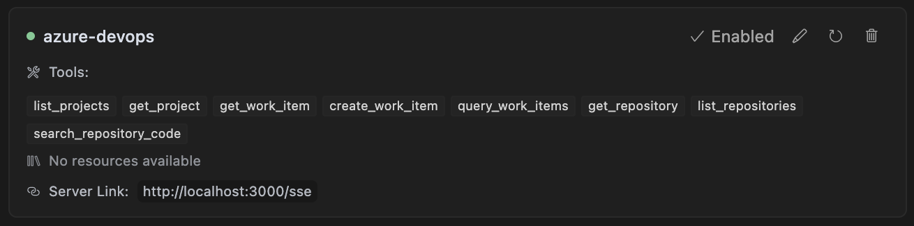

# Atlassian & GitLab MCP (Model Context Protocol)

This project serves as a reference server implementation for the Model Context Protocol (MCP) integrated with Atlassian products (Jira, Confluence) and GitLab. It enables AI assistants to interact with Atlassian and GitLab resources and perform operations programmatically.

## Features

- Atlassian API integration using REST API
- GitLab API integration
- Support for Model Context Protocol (MCP)
- Project management operations
- Issue management
- Content operations
- Search capabilities
- Repository management (GitLab)
- Merge request operations (GitLab)

## Prerequisites

- Node.js (v18 or higher recommended)
- Atlassian Cloud account with appropriate permissions
- Atlassian API Token
- GitLab account with access token (for GitLab features)

## Installation

1. Clone the repository:

```bash
git clone <repository-url>
cd atlassian-mcp
```

2. Install dependencies:

```bash
npm install
```

3. Configure environment variables:
   - Copy `.env.example` to `.env`
   - Fill in the required environment variables:

```bash
cp .env.example .env
```

## Add to Cursor

```bash
npm start
```

Then add to Cursor:

Make sure you use the path `http://localhost:3000/sse`. You can change ports by defining one in the env.



## Environment Configuration

The following environment variables need to be configured in your `.env` file:

- `ATLASSIAN_INSTANCE_URL`: Your Atlassian instance URL (e.g., https://your-domain.atlassian.net)
- `ATLASSIAN_API_TOKEN`: API Token for Atlassian
- `ATLASSIAN_EMAIL`: Email associated with your Atlassian account
- `GITLAB_URL`: Your GitLab instance URL (e.g., https://gitlab.com)
- `GITLAB_TOKEN`: Personal Access Token for GitLab
- Additional configuration variables as specified in `.env.example`

## Available Scripts

- `npm run build` - Build the TypeScript project
- `npm run dev` - Run the server in development mode with hot reload
- `npm start` - Run the production server

## License

MIT
